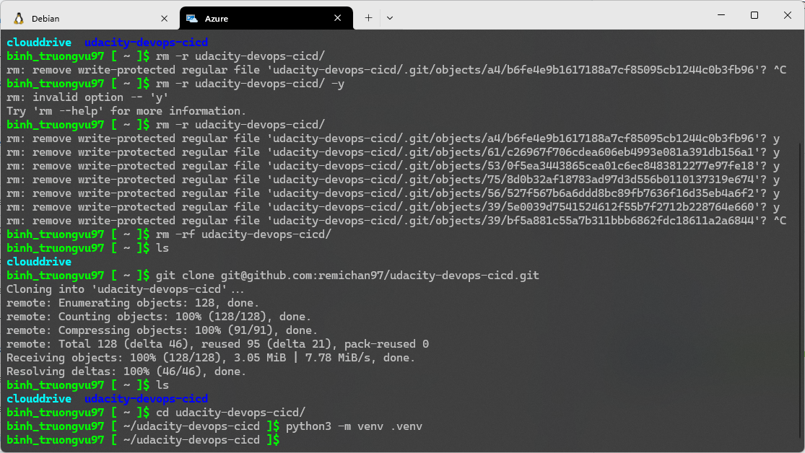

[](https://github.com/remichan97/udacity-devops-cicd/actions/workflows/python.yaml)  

[](https://dev.azure.com/binhtruongvu97/udacity-devops/_build/latest?definitionId=3&branchName=main)

# Project Overview
In this project, you will build a Github repository from scratch and create a scaffolding that will assist you in performing both Continuous Integration and Continuous Delivery. You'll use Github Actions along with a Makefile, requirements.txt and application code to perform an initial lint, test, and install cycle. Next, you'll integrate this project with Azure Pipelines to enable Continuous Delivery to Azure App Service.

You can see the Trello board of this project here: [Trello](https://trello.com/b/GfxFaGfN/udacity-project-2-board)  

There is also an Excel file containing project plans on the root of the project (see the ``Project Planning.xlsx`` file for project plans)

You can see a demo of the project here: [Demo video]()

## Environment
Python 3.11  
Azure Cloud Shell

# Architecture chart


# Testing changes in local

If you wish to test the app on your local machine, make sure you have ``Python 3.11``, ``python3-pip``, ``python3-venv`` packages installed on your machine if you are running on Linux, or install ``Python 3.11`` if you are on Windows. On Windows, installing Python will also installs pip and venv

First, clone the repo on your machine: 

```bash
	git clone https://github.com/remichan97/udacity-devops-cicd.git
```

Change the directory to the repository folder:
```bash
	cd udacity-devops-cicd
```

Install the requirements dependency, you can use the Makefile like so: 

```bash
	make install
```

or, you can install the requirements manually like so:

```bash
	python3 -m venv .venv
	source .venv/bin/activate
	pip install -r ./requirements.txt
```

Finally, run the app:

```bash
	python3 app.py
```

# Deploying app in Azure Cloud Shell
Go to the Azure portal in your web browser:
``
	portal.azure.com
`` and click Cloud Shell to spawn a new shell instance, or if you are using Windows, open Windows Terminal, then open a new Azure Cloud Shell tab

  

This will open a new tab, asking you to sign in, proceed with the prompt to finish the sign in. After which, you'll be dropped to a prompt like so:  
  
  
Fork this repo to your account, then clone your newly created fork on the Cloud Shell, you may have to generate an SSH key beforehand:  

```bash
	git clone https://github.com/<your_github_username>/udacity-devops-cicd.git
```



Then change directory to the repo:  

```bash
	cd udacity-devops-cicd
```

From the repo, update the ``AZ_WEBAPP_NAME`` variable inside the ``command.sh`` shell script with the web app name you want, then run the script to begin the deployment to your Azure account. When the deployment finished, you should see the URL of the deployed app from the output as shown:  


# Setting Up GitHub action to trigger Azure Pipeline on successful code linting workflow

Go to GitHub Marketplace, search for, and install the Azure Pipeline app, when asked, select the forked repo to grant the app access to the repo.


Included on the repo are the GitHub action workflow used during the deployment. This workflow lints and test our code and make sure it passed linting and testing before actually triggering the Azure Pipeline to build and deploy our code to the Web app. For this to work, we need to generate a personal access token on Azure DevOps. To do this, go to User Settings on Azure DevOps, select Personal Access Token:

  

Then, create a PAT with full access, copy the generated token, then go to your repo settings -> Secrets and Variables -> Actions

Create a new secret named ``AZURE_DEVOPS_TOKEN`` with its value of the access token you copied earlier


# Setting Up Azure DevOps for automatic deployment on Github action successful code linting

Now that we have the app up and running, it's time to setup Azure DevOps to automate the deployment process. This would deploy our changes automatically should we push a new commit to GitHub and it passed linting and testing.  

To start, go to ``https://dev.azure.com/``, and sign in to your Microsoft account. You will then be asked to create a new organisation, as well as creating a new project inside the newly created org. Please follow the prompt to do so.

When finished, you should now be redirected to the project landing page. On this page, select Pipelines -> Pipelines, then click on New Pipeline button

Select Github as the code source:  

  

You will now be asked to authorise Azure DevOps to access your GitHub account. After which, Azure DevOps will display all the available repos on your account, select the newly forked repo as the repository we wanted to setup Pipeline on


On the upcoming screen, select ``Python to Linux Web App on Azure``. Azure DevOps will now ask you which web app to deploy onto, select the app name seen on the deployment output in which we deployed earlier.

Azure DevOps should now generate a yaml file containing the configuration needed to deploy the app. Before commiting the yaml file to our repo, we need to modify a small line on the config file. We wanted to change trigger to none like so:

```yaml
	trigger:
	- none
```

Since we wanted to only deploy after the linting passed, this set up prevents the app from being deployed should the linting and testing did not pass. For now, click ``Save`` to commit the configuration file to your GitHub repo

When everything finished, we'll see the newly created pipeline listed:


# Load testing the app
Execute the following command to start load testing. Please note that I'm cuurently doing load testing on local machine: 

```bash
	locust -f ./locustfile.py --users 500 -- host mirai-azure-flash-ml.azurewebsites.net
```

This would spawn a web UI that can be access from a web browser, from it we can see the load testing in progress:


# What can be improved
 - Containerising the app using Docker
 - Deploy the app on an AKS instance
 - Create a front-end for making predictions instead of having to use curl to query the app
 - Migrate deployment pipeline to GitHub Actions from Azure Pipelines